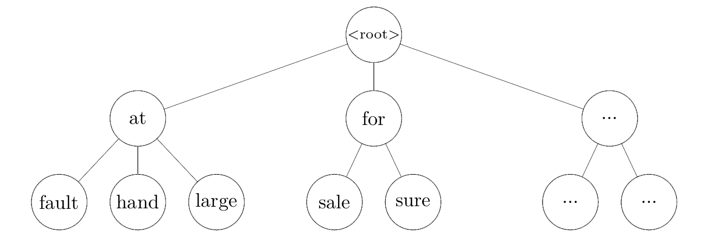

+++
slug = "/blog/mwe-lookup"
date = "2024-03-23"
title = "複数語表現の検索：多重集合の部分集合検索"
+++

最近、文中の[複数語表現](https://en.wikipedia.org/wiki/Multiword_expression)（MWE）の見つけ方について考えるのにかなりの時間をかけています。MWEの定義は曖昧で、定義次第で何がMWEに該当するかが変わりますが、今日はその点は置いておき、MWEの自動検出について説明します。

MWE検出の方法はさまざまですが、個人的には辞書ベースのものが好きです。簡単に言うと、MWEがたくさんあるリストが与えられ、そのうちのどれが文中に実際にあるかを割り出す手法です。これは以下のようなパイプラインとして表現できます：
1. 文中に存在し得るMWE（「可能なMWE」）を辞書から検索します。これは、辞書データから構成素がすべて文中にあるMWEを抽出する処理として考えることができます。辞書がうまく構造化されていないとかなり遅くなるので、本記事の大半はこの処理を効率化する方法の説明になります。
2. 検索された可能なMWEを構成し得る構成素の組み合わせを全て文中から「候補」として集めます。単純に可能なMWEに相当する単語の各組み合わせを見つける処理になりますが、記事の最後に説明します。
3. 各「候補」が実際にMWEであるかどうかを判断します。つまり、その構成素が慣用的/非構成的な意味を持つかどうかです。こうするには文脈における意味を判断できるシステムが必要であり、たいていの場合は機械学習に基づいた手法になります。昨年その方法の1つについて[論文](https://aclanthology.org/2023.findings-emnlp.14/)を出版しましたが、この記事で詳しく解説するには手法が多くて複雑すぎます。


上記の文に対して、この3つのステップは以下のようになります：

1. `run_down`, `run_over`, `fall_down`, `fall_over`を検索して可能なMWEとして取得します。これらの4件は、辞書から構成素がすべて文中に含まれているMWEのすべてです。
2. これらのMWEを文中の単語の組み合わせに対応付け、上図で描写されているように候補を見つけます。
3. 候補をフィルタにかけ、実際にMWEの意味になっている候補に絞り込みます。`fall_down`と`run_over`は明らかに間違っており、`run_down`というMWEは「（車両で）人をひく」のような意味なので、`fall_over`だけが残ります。

1つのMWEに対して候補の単語組み合わせが複数ある場合もあります。たとえば、最後の`down`を`over`に置き換えて「I ran down the stairs and fell down」にすると、`run_down`の構成し得る組み合わせが2つあります。1つ目は`ran`と最初の`down`であり、2つ目は`ran`と二番目の`down`です。この問題に対応しやすくするためにも、ステップ＃1と＃2を分割して行うのがおすすめです。

## 可能なMWEの検索
さて、主題のステップ＃1である可能なMWEの検索について説明しましょう。MWEの中に、その出現に制約があるものもありますが、動詞のMWEも考慮に入れると汎用的な制約がほとんどありません。まず`She put her beloved dog down`の`put_down`のように、構成素が連続している必要はありません。さらに`the beans have been spilled`の`spill_the_beans`のように、順序さえ保証されていません。最後に、MWEの構成素が重複しないとも限りません。その例として`face_to_face`などがあります。

構成素が順序に従う必要がなく、重複しない保証もないことを考えると、可能なMWEの検索という問題は次のように形式化できます。入力文の単語の多重集合*S*と、可能なMWEごとの多重集合を含む集合*L*が与えられた場合、*S*の部分集合でありかつ*L*に含まれる要素を見つけることです。


その結果、*M*をMWEごとの多重集合の平均要素数とし、最悪計算量は*O(M * |L|)*というかなりひどい上限になります。辞書内の各MWEが文中の単語の部分集合であるか否かを調べる単純な手法だと、各文ごとに全てのMWE多重集合を処理することになってしまうので、非常に遅くなります。

```python
class NaiveApproach:
    def __init__(self):
        self.data = [
            (mwe['lemma'], Counter(mwe['constituents']))
            for mwe in get_mwes()
        ]

    def search(self, words: list[str]) -> list[str]:
        word_counter = Counter(words)
        return [
            mwe for mwe, constituents in self.data
            if all(
                word_counter[constituent] >= count
                for constituent, count in constituents.items()
            )
        ]
```

このコードは私のノートパソコンで1,000文を処理するのに平均して28秒かかります。しかし、[トライ木](https://ja.wikipedia.org/wiki/%E3%83%88%E3%83%A9%E3%82%A4_(%E3%83%87%E3%83%BC%E3%82%BF%E6%A7%8B%E9%80%A0) )を使用することで大幅に高速化できます[^1]。トライ木は通常、文字から構築されるものですが、この場合は文字ではなくて単語を扱っているため、単語から構築します。




MWEのトライ木を辞書として使用すると、深さ優先探索で可能なMWEを集めることができます。この探索は、文中にない単語のノードに突き当たったところで中断します。つまり、文中の単語の部分集合であるトライ木の部分のみをたどることができます。

```python
class TrieNode:
    __slots__ = ['lemma', 'children']

    def __init__(self, lemma: Optional[str]):
    	# lemma represents a possible MWE that terminates at this node
        self.lemma = lemma  
        self.children = {}


class Trie:
    def __init__(self):
        self.tree = self._build_tree(get_mwes())

    def _build_tree(self, mwes: list[dict[str, str]]):
        root = TrieNode(None)
        for mwe in mwes:
            curlevel = root
            for word in mwe['constituents']:
                if word not in curlevel.children:
                    curlevel.children[word] = TrieNode(None)
                curlevel = curlevel.children[word]

            curlevel.lemma = mwe['lemma']

        return root

    def search(self, sentence: list[str]) -> list[str]:
        counter = Counter(sentence)
        results = []
        self._search(self.tree, counter, results)
        return results

    def _search(self, cur_node: TrieNode, counter: Counter, results: list):
        possible_next_constituents = [c for c in counter if counter[c] > 0 and c in cur_node.children]

        for constituent in possible_next_constituents:
            next_node = cur_node.children[constituent]
            counter[constituent] -= 1
            if next_node.lemma is not None:
                results.append(next_node.lemma)
            self._search(next_node, counter, results)
            counter[constituent] += 1
```


これで辞書内のMWE間で共有される接頭辞を一つだけ保存できるようになりますが、主な利点は上記のように検索を行うことで、最初の単語が文中に含まれないMWEに対して計算資源を一切費やさないことです。こうするとかなり早くなり、1,000文を平均で0.8秒で処理できます。しかしもう少し早くすることはまだ可能です。

英語の単語出現頻度は[大きく偏っており](https://ja.wikipedia.org/wiki/%E3%82%B8%E3%83%83%E3%83%97%E3%81%AE%E6%B3%95%E5%89%87)、出現頻度の高い単語から始まるMWEも多いです。この実験で使用した比較的に小さい辞書でも、`in`から始まるMWEが169件もあります。たとえば`in_theory`, `in_unison`, `in_vain`, などがあります。構成素が全て文中にあるMWEしか求めていないため、出現の可能性が最も低い単語の有無を最初に調べた方が効率が良いはずです。つまり、一番出現頻度の低い単語から処理するということです。トライ木に入れる前に、[出現頻度のデータ](https://raw.githubusercontent.com/arstgit/high-frequency-vocabulary/master/30k.txt)を用いてMWEの構成素を出現頻度の低い順に並び替えることでこういった検索を実現できます。注意点としては、単語を共有して順序だけで区別されるMWEを扱う場合（例えば`roast_pork`や`pork_roast`）には、トライ木の1つのノードに複数のMWEを結びつける必要がありますが、わずかな変更で済みます。

```python
class OrderedTrie:
    # not pictured here: 
    # 1) TrieNode now holds a list of lemmas instead of a single lemma
    # 2) _search needs one line changed to return all lemmas on a node 

    def __init__(self, word_data: dict[str, int]):
        # any missing words are treated as last in the frequency list
        self.word_freqs = defaultdict(lambda: len(word_data), word_data)
        self.tree = self._build_tree(get_mwes())

    def _reorder(self, words: list[str]) -> list[str]:
        # sort by word frequency, then alphabetically in case
        # both words are missing from word_freqs
        return sorted(words, key=lambda w: (self.word_freqs[w], w), reverse=True)

    def _build_tree(self, mwes: list[dict[str, str]]):
        root = OrderedTrieNode([])
        for mwe in mwes:
            curlevel = root
            for word in self._reorder(mwe['constituents']):
                if word not in curlevel.children:
                    curlevel.children[word] = OrderedTrieNode(word)
                curlevel = curlevel.children[word]

            curlevel.lemmas.append(mwe['lemma'])

        return root
```

この並び替えた構成素のトライ木の手法を使うと、平均でたった0.5秒で1,000文を処理することができ、前述のトライ木より４割程度早くなります。各種法の平均処理時間は以下のグラフに表示されています（対数スケール）。


単純な検索手法からトライ木に基づいた手法に切り替えることは割と明白な改善と言えますが、ここで興味深いのはトライ木の構造を単語の頻出度で最適化することによる高速化だと思います。なにより、処理しようとしているデータやドメインを理解する重要性の示す良い例でしょう。このさらなる高速化は英文の単語である入力データの分布を考えて初めて可能になるものです。

## 検索された可能なMWEと候補の単語組み合わせの対応付け

これで可能なMWEを検索する方法はわかったので、特定のMWEを構成し得る単語の組み合わせを文中から全て見つけるステップ#2を簡単に見てみましょう。文`I ran down the stairs and fell down`とMWE`run_down`の場合、まず文をトークン列として、MWEを多重集合として表現できます。

```python
from collections import namedtuple, defaultdict
from itertools import combinations, product

token = namedtuple("Token", ["form", "idx", "lemma"])
sentence = [
    token("I", 0, "I"),
    token("ran", 1, "run"),
    token("down", 2, "down"),
    token("the", 3, "the"),
    token("stairs", 4, "stairs"),
    token("and", 5, "and"),
    token("fell", 6, "fall"),
    token("down", 7, "down"),
    token(".", 8, "."),
]

# build a map of lemmas to tokens
# so we can look up tokens by their lemma
lemma_to_tokens = defaultdict(list)
for t in sentence:
    lemma_to_tokens[t.lemma].append(t)

# mwe: "run_down"
lemma_counter = {
    "run": 1,
    "down": 1,
}
```

以下のコードは一見では分かりづらいかもしれませんが、やっていることはそれほど複雑ではありません。MWEに含まれる各見出し語に選べるトークンをタプルとして表現し、可能な選択肢を全て集めます。ちなみにこれは各見出し語に対してN語からK語を選ぶ組み合わせを求めることに相当します。ここで、Nはその見出し語が文中に出現する回数であり、Kはその見出し語がMWEに出現する回数になります。得られたタプルには、通常の場合は1つの要素しか含まれませんが、`face_to_face`のように同じ構成素が繰り返されるMWEでは複数の要素が含まれることがあります。
```python
candidate_word_combos = [
    list(combinations(lemma_to_tokens[lemma], lemma_counter[lemma]))
    for lemma in lemma_counter
]
```
上記のコードを走らせると、以下の結果が得られます。
```python
[
    [
        (Token(form='ran', idx=1, lemma='run'),)
    ], 
    [
        (Token(form='down', idx=2, lemma='down'),), 
        (Token(form='down', idx=7, lemma='down'),)
    ]
]
```

最後に、これらのタプルのリストごとに直積集合を取り、タプルを展開（アンパック）します。各タプルは見出し語にトークンを選ぶ方法を表現しているので、これは実質的に各見出し語に対して単語の選び方の組み合わせを全て検討することになります。それはつまり、元々の目的である、特定のMWEを構成し得る単語の組み合わせを得ることができます。仕上げに、結果に含まれるトークンの順番を直します。
```python
mwe_combinations = {
    tuple(x for y in p for x in y) 
    for p in product(*candidate_word_combos)
}

sorted_mwe_combinations = [
    sorted(raw_combo, key=lambda t: t.idx) 
    for raw_combo in mwe_combinations
]
```
そして最終結果が以下となります。
```python
[
    [
        Token(form='ran', idx=1, lemma='run'), 
        Token(form='down', idx=2, lemma='down')
    ], 
    [
        Token(form='ran', idx=1, lemma='run'), 
        Token(form='down', idx=7, lemma='down')
    ]
]

```


&nbsp; 

<hr/>

[^1]: トライ木に基づいた手法の方が平均で圧倒的に早いですが、理論上の最悪計算量は単純な手法と変わりません。しかし、トライ木の手法ででこの上限に近づくためには、辞書内のほとんどまたは全てのMWEを含む一文が必要なので、現実的にはとても考えにくいです。


