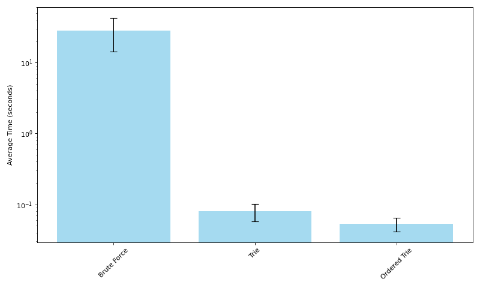

+++
slug = "/blog/mwe-lookup"
date = "2024-03-23"
title = "Multiword expression lookup: multiset subset retrieval"
+++

I have recently spent quite a bit of time thinking about how to find [multiword expressions](https://en.wikipedia.org/wiki/Multiword_expression) (MWEs) in a sentence - I even wrote a [paper](https://aclanthology.org/2023.findings-emnlp.14/) about it. Multiword expressions are a pretty messy topic and there is a lot of ambiguity about what even counts as an MWE, but for this post I want to put that aside and talk about a specific problem: retrieving relevant MWEs for a given sentence. 

I am fan of lexicon-based approaches to MWE identification, which just means that given a very large list of possible MWEs you are trying to figure out which of them might be present in a given sentence. This generally breaks down into a pipeline approach that looks something like this:
1. Retrieve all of the MWEs that _could_ be present in a sentence
2. Map the retrieved MWEs to concrete "candidates", which are combinations of constituent words in the sentence corresponding to a possible MWE
3. Decide if each "candidate" is actually an MWE - that is, whether its constituents take on an idiomatic/non-compositional meaning

#3 above requires a system capable of making judgements about meaning in context, which typically means machine learning based approaches. Assuming that applicable MWEs have already been retrieved, #2 is fairly straightforward and just requires finding each combination of words in the sentence that correspond to a retrieved MWE. For example, given the below sentence, these steps might look like this.

# TODO: image from poster

1. Retrieve `run_down`, `run_over`, `fall_down`, `fall_over` as possible MWEs
2. Map each of these MWEs to candidate groups of words in the sentence, as pictured in the above diagram
3. Filter these so that we keep only the candidates that actually constitute MWEs, which in this case is just `fall_over` (`run_down` as an MWE meaning `(of a vehicle) hit a person or animal and knock them to the ground.`)

Note that in many cases there are multiple candidate word groups for a single MWE. For example, if we replace the last `down` with `over` for `I ran down the stairs and fell down`, there are now at least two possible instances of `run_down` - one for `ran` and the first `down`, and another for `ran` and the second `down`. This is also why it is convenient to split #1 and #2 into separate steps.


## How to retrieve possible MWEs 
While some MWEs have constraints on how they can be formed in a sentence, if we include verbal MWEs there are very few gaurantees. They do not have to be contiguous - see `put_down` in `She put her beloved dog down` - and worse, they do not even have to be in order - see `the beans have been spilled` for `spill_the_beans`. Finally, the constituent words of an MWE are not always unique, such as in `face_to_face`.

Given all of the above, the formalization of our possible MWE retrieval problem is: given a multiset *S* for the input sentence, and a set *L* containing multisets for each possible MWE, find all members of *L* that are strict subsets of *S*. 

# TODO: math symbols

This means a worst case runtime of *O(M * |L|)* where *M* is the average size of an MWE multiset. This is a very expensive upper bound, and consequently the naieve approach below of checking if every possible MWE is a subset of the words in the sentence ends up being very slow. 

```python
class NaieveApproach:
    def __init__(self):
        self.data = [
            (mwe['lemma'], Counter(mwe['constituents']))
            for mwe in get_mwes()
        ]

    def search(self, words: list[str]) -> list[str]:
        word_counter = Counter(words)
        return [
            mwe for mwe, constituents in self.data
            if all(
                word_counter[constituent] >= count
                for constituent, count in constituents.items()
            )
        ]
```


This code takes an average of 28 seconds on my laptop to process (call `search()` on) 1,000 sentences. Fortunately, we can make this much faster using a [Trie](https://en.wikipedia.org/wiki/Trie)[^1]. Tries are prefix trees most commonly built out of characters, but because we are dealing with sequences of words, we can also build it out of words. 

# TODO: trie image

Using our MWE trie, we can gather candidate MWEs with a depth-first search starting at the root that aborts any time continuing down a branch of the trie would require constituents not found in the sentence. That is, we traverse only the parts of the trie that are subsets of the multiset consisting of words in the sentence. 

```python
class TrieNode:
    __slots__ = ['lemma', 'children']

    def __init__(self, lemma: Optional[str]):
    	# lemma represents a possible MWE that terminates at this node
        self.lemma = lemma  
        self.children = {}


class Trie:

    def __init__(self):
        self.tree = self._build_tree(get_mwes())


    def _build_tree(self, mwes: list[dict[str, str]]):
        root = TrieNode(None)
        for mwe in mwes:
            curlevel = root
            for word in mwe['constituents']:
                if word not in curlevel.children:
                    curlevel.children[word] = TrieNode(None)
                curlevel = curlevel.children[word]

            curlevel.lemma = mwe['lemma']

        return root

    def search(self, sentence: list[str]) -> list[str]:
        counter = Counter(sentence)
        results = []
        self._search(self.tree, counter, results)
        return results

    def _search(self, cur_node: TrieNode, counter: Counter, results: list):
        possible_next_constituents = [c for c in counter if counter[c] > 0 and c in cur_node.children]

        for constituent in possible_next_constituents:
            next_node = cur_node.children[constituent]
            counter[constituent] -= 1
            if next_node.lemma is not None:
                results.append(next_node.lemma)
            self._search(next_node, counter, results)
            counter[constituent] += 1

```


This allows us to store only a single copy of any prefixes shared between multiple MWEs in our lexicon, but the main benefit is that searching this way means we will expend no compute on MWEs whose first word is not present in the sentence. This is _much_ faster, and gets through 1,000 sentences in 0.8 seconds on average. However, we can still make it a little faster.

Word frequency in English is [very imbalanced](https://en.wikipedia.org/wiki/Zipf%27s_law), and many MWEs start with common words. For example, my relatively small lexicon has 169 MWEs starting with `in` (`in_theory`, `in_unison`, `in_vain`, etc.). Since we only want MWEs where all words are present in the sentence, it makes more sense to look at the words least likely to be present first - that is, the lowest frequency words. We can do this by re-ordering the MWEs before we insert them into the Trie using pre-computed word frequency. This means that in rare cases where MWEs share the same words and are differentiated only by order (like `roast_pork` and `pork_roast`) we will need to attach multiple MWEs to one node in the Trie, but other than that it requires only minor changes.

```python
class OrderedTrie:
	# not pictured here: _search also needs one line changed
	# to add all the lemmas on a node, since node.lemmas is now a list

    def __init__(self, word_data: dict[str, int]):
    	# any missing words are just max frequency
        self.word_freqs = defaultdict(lambda: len(word_data), word_data)
        self.tree = self._build_tree(get_mwes())

    def _reorder(self, words: list[str]) -> list[str]:
        # sort by word frequency, then alphabetically. 
        # need alphabetical sorting in case both words are missing from word_freqs. 
        # least common words come first
        return sorted(words, key=lambda w: (self.word_freqs[w], w), reverse=True)

    def _build_tree(self, mwes: list[dict[str, str]]):
        root = OrderedTrieNode('<ROOT>')
        for mwe in mwes:
            curlevel = root
            for word in self._reorder(mwe['constituents']):
                if word not in curlevel.children:
                    curlevel.children[word] = OrderedTrieNode(word)
                curlevel = curlevel.children[word]

            curlevel.lemmas.append(mwe['lemma'])

        return root

```

Using this re-ordered trie approach, it takes only 0.5 seconds on average to process 1,000 sentences, which is about a 40% speedup over the normal trie. The average time for each of the three methods can be seen in the graph below, though note that it is log scale. 



Moving from the naieve approach to using a trie is arguably a fairly obvious optimization; the further speedup we get from using word frequency to inform trie construction is the interesting thing here, and a good demonstration of how much it can help to have a good understanding of the data you are trying to process. 

<hr/>

[^1]: Note that while the Trie-based approach runs much faster on average, its theoretical worst case runtime is the same as the naive approach. However, getting anywhere near this upper bound with the Trie would require a sentence containing most or all of the MWEs in the lexicon, which is not realistic.


