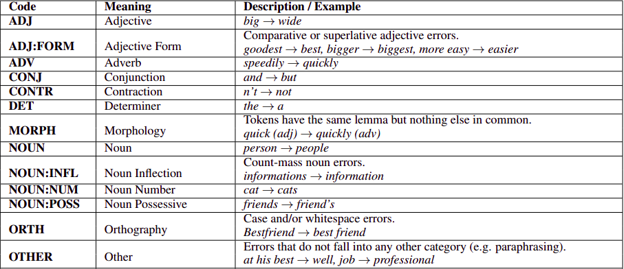
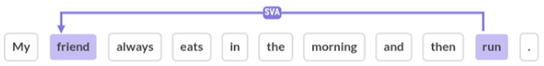

+++
slug ="/blog/error-categories"
date = "2021-04-12"
title = "Funny = おもしろい = Interesting? Categorizing grammatical error explanations"
description = "What kind of errors do English learners make, and how can they be categorized?"
+++

I recently worked on a research project attempting to group grammatical errors into categories that could be explained similarly, and develop a process to automatically generate explanations for a particular category. This ultimately didn't pan out as a research idea, but the time I spent working on it gave me some perspective on how one might categorize errors for the purpose of explaining them. This post will be about some of the categorizations I settled on for trying to explain errors, and what I found interesting about them - it will _not_ include technical implementation details from said research, although I will link to a few papers and other outside resources. A couple disclaimers up front:

1. These categories are subjective, and only really useful as a way to group together errors that can be explained similarly. 
2. There is very rough information about the distribution of these categories at the end of the post, but they are mostly presented in the order I thought would be enjoyable to read, not from most to least common.
3. A post covering every possible type of error would be too long for most people to read, and too long for me to write, so this post won't attempt to do that. 
4. These categories aren't limited to English, but the examples are English and some categories may be primarily applicable to English. 

## How are errors normally classified?
There isn't really a standard set of categories for grammatical errors, so categorizations can vary wildly depending on the goals of the project. The closest thing that the natural language processing community has to a standard set of categories is provided by an automatic classification tool called [ERRANT](https://www.aclweb.org/anthology/P17-1074.pdf), which categorizes errors in pairs of erroneous and corrected sentences based on the content that was changed in the corrected version.

ERRANT is a great tool for analysis, but its categories are not exceptionally useful for explaining to someone why their error is an error, and it classifies about 20% of errors as `OTHER`[^ec_1]. Note that this prevalence of `OTHER` type errors is not a reflection of some kind of failure on ERRANT's part; some portion of errors simply do not fit cleanly into any kind of category.

The theoretical linguistics community has a wider variety of categorizations to offer, although most are still aimed at analysis, and I don't know of any that specifically target being comprehensible for language learners or are widely used in a teaching context. If you do, please let me know.

## Some errors are beyond help
As the prevalence of ERRANT's `OTHER` category hinted at, some errors are simply not classifiable or explainable. This is most often when the content produced by a learner is so garbled that it looks near random, and restoring it to a correct state would require something closer to a rewrite. Below are some excerpts taken from publically available grammatical error correction data[^ec_2]:

> Unfortunately I had ever been in the US so I have any idea about how much money I will probably need and about what kind of clothes I have to take with me.
> 
> Regarding the programme you have organised, it is great ideas everything that you have planed, but I would like to suggest to you something that the students saw in an advertisement.

How would you explain what's wrong with the above sentences? The first seems to be a case of the author dropping negations in places they are necessary, but not in any way that fits cleanly into a category of some kind: `ever` should be `never`, `have` should be `don't have`, and so on. The second sentence is surprisingly comprehensible despite being a grammatical mess, but the area around `it is great ideas everything` doesn't reduce cleanly to a specific type of error. That said, there are plenty of sentences with errors that are quite a bit more amenable to classification.

As my research focused on explaining errors to language learners, the classifications I present below will be heavily focused on the reasons behind an error, such as what specific rule it breaks or why the learner might have made the mistake. These classifications are not necessarily intended to be explanations in and of themselves, but each category represents a group of errors that can be explained similarly. Additionally, many errors can arguably fit into more than one category. 

## Semantic errors

These are my favorite kind of error, partly because in the strict sense they often have nothing to do with actual grammar, and partly because they can be pretty fun. This category can really be summarized as: "you produced (mostly) valid output that doesn't communicate your intended meaning". 

Let's look at an example: 

> Interestingly, nowadays, I live in the scientific world which I read in the book.

This sentence obviously looks weird, but what's wrong? Everything looks fine grammatically - we get a reasonable sentence by just switching out one transitive verb for another.

> Interestingly, nowadays, I live in the scientific world which I saw in the book. 

This is still slightly unnatural, mostly due to article use, but we will come back to articles later. The point I want to make is that the fundamental problem in the original sentence is in the phrase `the scientific world which I read in the book`. This should be even more obvious if we take this from a relative clause to a normal English sentence: `I read the scientific world in the book.` The English verb `read` takes a direct object, as in `I read a magazine`, but there is no sensible interpretation of `read a world`. The author of this sentence was just one `about` away from what they likely wanted to say, which was `the scientific world which I read about in the book`.

Here are a couple more examples of sentences with semantic errors:
> I would prefer to live in log cabins because I think they are more comfortable than tents. 
> 
> She has to do it , and is a sacrifice .
> 
> If I look back in the past I can find that computer is following the same street of television, telephon and a lot of other things...

The semantic issues, in order, are:
1. Living in multiple log cabins at once
2. The subject of the sentence being a sacrifice, when the intended meaning is that the action is a sacrifice
3. `follow the same street` doesn't have the idiomatic meaning in English that the author is looking for, in the way that `follow the same route` would

### Word choice and native language interference

A lot of semantic errors boil down to choosing the wrong word - I.E. `read` instead of `saw` or `street` instead of `route`. Oftentimes even if  the learner knows _of_ the correct word, they don't know that it's the correct word for their specific sentence, and they end up making the choice using information from their first language. Concretely, this usually means using the first available translation of the word with the correct semantics in their first language. Let me give an example. 

The meaning of the Japanese word `おもしろい` (omoshiroi) encompasses the standard uses of both `funny` and `interesting` in English. While these are sufficiently basic words that most learners know better, if you see a native Japanese speaker say something like `the comedy was so interesting` or `the documentary was so funny`, there's a good chance that the root of the problem is that both these words map back to `おもしろい` and they picked the wrong translation. In order to be able to identify errors of this particular type you obviously need to speak the native language of the learner whose errors you're correcting, but if you can identify the word in the learner's native language which has been (mis)translated into the incorrect word it can make explaining the problem much easier (and also may help clarify whether something is actually expressing the intended meaning or not).

This kind of native language interference based on mistranslation seems like the kind of thing that should be fairly accessible to automated approaches as well, although I can only find [one paper](https://www.aclweb.org/anthology/D11-1010.pdf) in that vein.

## Words that don't play well together

This category lumps together a fairly wide range of grammatical phenomena that arguably don't have a lot to do with each other, except that they can all be explained as an incompatibility  between a small number of words or phrases. 

The prototypical example of this in English is the subject/verb agreement error. English requires present tense nouns to match the plurality and/or person of their subject; this is the reason `the dog runs` is fine, but `the dogs runs` is not. 

Tense agreement is another good one; English often doesn't like it when verbs in a subordinate clause are in a different tense than the verb that owns this clause. In simple terms, this is why you can't say `I thought that I will go to the store`. This phenomenon also extends to sequences of verbs - changing tense in sequential verbs doesn't work in English.

This could even include cases where coreferring nouns and pronouns mismatch, such as plural subjects and singular pronouns like `My friends took his dog home,` although these can often also be explained as semantic errors. 

### Case frames

Oftentimes, the words that can reasonably be used with a given word are not defined by broad grammatical rules like subject/verb agreement, but by the word itself. Linguistics - in particular, semantics - has a concept for this, which it calls case frames. Wikipedia has some relatively [brief](https://en.wikipedia.org/wiki/Case_grammar) [articles](https://en.wikipedia.org/wiki/Frame_semantics_(linguistics)) on the topic, but the idea is that a given word (usually a verb) has a finite set of "frames" that it can invoke, each with its own meaning and information about what words can reasonably be used along with that word. This is all very abstract, so let's look at an example (from [this paper](https://www.semanticscholar.org/paper/Extracting-Formulaic-Expressions-and-Grammar-and-to-Chen-Chang/c697f852e8f17c96e641858e9f88a0986ccb4b65)):

- afford: V to-inf (afford to pay/miss)
- afford: V n (afford a lawyer/attorney/car/house)
- afford: V n n (afford them the opportunities/protection)

The `V` is standing in for the actual verb `afford` here (because it could be conjugated, I.E. `afforded`), but what you should take from this is that `afford` can be used with the following:

1. A to-infinitive verb.
2. A single noun as a direct object.
3. A noun direct object and another noun indirect object. 

Arguably some other parts of speech in English can also have case frames, such as `good <at> <ing-verb>` ("good at running"). All that said, how is this all relevant to explaining grammatical errors? The answer is that a very large number of errors that would otherwise defy explanation can be reduced to violations of a case frame. For example:

> There were so many seats that it took long to finish clearing .

This is perfectly understandable, but sounds weird because the appropriate case frame for `take` (as well as all the other case frames for `take`) doesn’t  include an adjective. Instead, this `take` requires a noun - its direct object. Other examples of case frame violations include things like  `I am interesting in...`, or `...asking you a full refund`. `interesting` has no case frames that accept any other words, and while `ask` has a case frame that takes a direct object like `ask a question`, it’s nonsensical here and should be `ask for`. 

I am not suggesting that every learner should receive a lengthy explanation of case grammar, but I do think that it is a good way to formalize a lot of word incompatibility issues. Even if the term "case frame" never comes up, showing a learner whose mistake has violated a case frame a set of examples from the common case frames for that word is a quick and easy way to communicate acceptable usage. Also, case frames are deeply tied in with preposition usage - the preposition(s) following a verb typically reflect a specific  case frame - and at least from the data we have publically available, preposition errors account for about one in ten errors[^ec_1].

Case frames can be fairly easily computed from a large corpus of text, so there has been some work on using automated methods to extract correct case frames and then using  them to explain errors to learners[^ec_3]. The University of Kyoto also has a great [database of Japanese case frames](https://nlp.ist.i.kyoto-u.ac.jp/index.php?%E4%BA%AC%E9%83%BD%E5%A4%A7%E5%AD%A6%E6%A0%BC%E3%83%95%E3%83%AC%E3%83%BC%E3%83%A0), which can be searched [here](https://lotus.kuee.kyoto-u.ac.jp/cf-search/), although I know of no equivalent resources for English.

A full explanation of the possible applications of case frames is beyond the scope of this post, but it's worth noting that while the frames here contain syntactic information about acceptable parts of speech and verb forms, the original idea behind case frames was focused on semantic information, such as the type of object that was semantically acceptable for a verb (I.E. the object of `drink` is typically a liquid). This gets fairly subjective fairly quickly, but if you like semantic case frames, they can explain quite a few errors that would otherwise fall into the **Semantic errors** category above. The first example about `reading a world` is a pretty clear semantic case frame violation. A great resource for semantic case frames is [FrameNet](https://framenet.icsi.berkeley.edu/fndrupal/).

## Determiners and mass nouns

This is the one category which corresponds nearly 1:1 with an existing ERRANT category. Determiner errors are hard - with determiner errors accounting for approximately one in ten errors[^ec_1] - and unfortunately, also often hard to explain. Note that determiners include possessives like `your`, quantifiers like `all`, and a few other things, but the main offenders  here are really the articles `the` and `a`. 

Let's return to a previous example:
> If I look back in the past I can find that computer is following the same street of television, telephon and a lot of other things...

There are two determiner problems here:

1. There should be a `the` after the first `that` for `I find that the computer`. As is, it sounds like `computer` is the direct object of `that`, and while `find` has a case frame that accepts a direct object, it's not the right one here.
2. Either `television` or `telephone` need a `the` before them. Normally when listing nouns, `the` comes at the beginning of the list, but it can go either way here because `television` is a [mass noun](https://en.wikipedia.org/wiki/Mass_noun).

I bring up mass nouns here because while many determiner errors are resistant to any kind of reasonable explanation, one of the common mistakes that's relatively straightforward to explain is that mass nouns like `water`, `information`, etc. don't take `a` or `the` in front of them. Outside of that, this is a category of errors that I often find myself unable to explain, so I don't have any sage advice here.

Most explanations reduce to something along the lines of "`the` is appropriate for referencing specific things, where `a` is for non-specific things", but I've yet to see one that doesn't break down or at least stretch pretty thin for edge cases. If you can confidently justify _why_ `the` is more appropriate than `a` in the below sentence[^ec_4] without resorting to "that's just how English is spoken”,  then you know something I don't. It sure seems to me like there's more than one forecast for tomorrow, and the person asking the question isn't asking about one in particular. 

> What's the forecast for tomorrow?

The last thing I will mention is that in regard to article errors in particular, their frequency can depend heavily on whether the learner's native language includes them or not. 

## Spelling errors

This is a fairly trivial category, but I included it because it's such a common one that it felt negligent to leave it out. In the overwhelming majority of cases, all you can really do with spelling errors is provide the correct spelling for the misspelled word, and if you're teaching English apologize for the incredibly inconsistent spelling. That said, there are occasionally errors that look like misspelled words but have something more interesting going on.

> As they know about your interestings and personality , it is easy to help you .

`interestings` isn't a word in English, but it sure looks like it could be. One way to look at this is that the person writing this has correctly spelled a word that just happens not to exist, and might benefit more from an explanation of why that word doesn't exist (`interesting` is an adjective and has no plural) than a simple spelling correction.

## In closing

The error examples here were all marked as errors by professional annotators in publically available data, but it's not just categorizations of errors that are subjective - even native speakers can disagree about what constitutes an error at all. Additionally, some things marked as errors really just boil down to nonstandard language usage or unusual collocations. `fast car` is arguably preferable to `quick car` only because the previous is more common, and `musical show` only sounds weird to native speakers because English has a noun `musical` that means the same thing. 

I promised that I would provide rough information about the distribution of these error types at the end of the article, so below is a table containing the *percentage of erroneous sentences that had a type of error* when I annotated a couple hundred sentences at random. This is not the percentage of errors - that would probably be more useful, but this was much easier to annotate and I was in a hurry - so with overlap it's not going to sum to 100%. 

| Error Category | Present in % of examples |
| -------------- | ----------- |
| Semantic error | 24% |
| Words that don't play well together | 25% |
| Determiners and mass nouns | 19% |
| Spelling errors | 22% |
| Unclassifiable | 15% |

Thanks for reading until the end. I hope that this was interesting, if not useful. 

[^ec_1]: [The BEA-2019 Shared Task on Grammatical Error Correction](https://www.aclweb.org/anthology/W19-4406.pdf)

[^ec_2]: Example sentences are sampled from [BEA-2019](https://www.cl.cam.ac.uk/research/nl/bea2019st/) FCE v2.1 and NUCLE datasets.

[^ec_3]: [Correcting Preposition Errors in Learner English Using Error Case Frames and Feedback Messages](https://www.aclweb.org/anthology/P14-1071.pdf) and [Extracting Formulaic Expressions and Grammar and Edit Patterns to Assist Academic Writing](https://www.semanticscholar.org/paper/Extracting-Formulaic-Expressions-and-Grammar-and-to-Chen-Chang/c697f852e8f17c96e641858e9f88a0986ccb4b65)

[^ec_4]: Unlike other examples, I made this one up.

