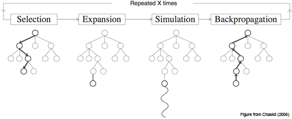

+++
slug = "/blog/vocabulary-optimization"
date = "2025-02-16"
title = "【玉ねぎ＝泣く野菜】人工言語のための複合語生成"
+++

日本語を学んでいく中で特に印象的だったのは、覚えた漢字が一定数を超えると、それまで見たことのない単語でも読めたり意味を推測できたりすることです。これは漢字そのものが意味を持つから可能になることです。たとえば、建物は建つ物、自信は自分を信じること、などのように漢字から意味がわかる単語が少なからずあります。初めて耳にする言葉でも、その漢字を推測して意味に辿り着けることがあります。

英語でも見たことのない単語の意味を推測できる場合はありますが、主に`-ness`（例：kindness）や`re-`（例：rewrite）といった生産的な[^vo_4]接辞か、認識しやすいラテン語由来の語根を持つ単語です。英語において、漢字から推測可能な単語に最も近いのは複合語だと思っています。すべてが推測可能というわけではありませんが、`mailbox`（郵便箱）、`firefighter`（消防士）、`waterfall`（滝）など、わかりやすいものもあります。この話がなぜ大事なのかというと、こういった推測しやすい複合語が多いほど新しい語彙を覚える負担が減るからです。たとえば、[エスペラント](https://ja.wikipedia.org/wiki/%E3%82%A8%E3%82%B9%E3%83%9A%E3%83%A9%E3%83%B3%E3%83%88)（最も広く使われている人工言語）は、生産的な接辞と複合語を広範に活用しています（今回話すのは複合語のみですが）。

さて、本題は複合語を自動生成する方法があるかどうかですね。複合語を構成する単語がその複合語の意味と関連している必要があります。同時に、語彙全体も考える必要があります。1つの単語が多くの複合語に使われすぎると、手がかりとしての役割が薄れます。そのため、複数の基準を考慮しながら、最適な複合語語彙を見つける方法が必要になります。

## 探索問題としての捉え方

まず初めに、単語（複合語を含む）で表現したい意味の集合を考えます。これらを「アイデア」と呼び、英単語で表現します。このアイデアの集合 を*I*とし、 語彙を構築するプロセスは、*I* から基礎語の集合 *B* を選び（*B ⊂ I*）、*I* の残りの要素を *B* の2つの単語を組み合わせた複合語として表現することと考えられます[^vo_1]。これにより、複合語の集合 *C* が生まれます。*C* の各要素は、アイデアと2つの基礎語を表すタプルになります：*C = { (i, b1, b2) ∣ b1 ∈ B, b2 ∈ B, i ∈ I }*。

たとえば、以下のような3つの単語が *I* に含まれているとします：

> sky

> water

> rain

この場合、最適な結果は `sky` と `water` を基礎語に選び、`rain` を `skywater` という複合語で表現することだと言えるでしょう。つまり、基礎語の集合は以下のようになります：

> *B* = {sky, water}

そして、それらが組み合わさって以下の複合語の集合が得られます：

> *C* = {(rain, sky, water)}

実際の言語では *I* が何千、何万といった規模になるため[^vo_2]、これを手作業で行うのは現実的ではありません。しかし、*I* から*B* と *C* を生み出す処理を、*I*の要素を*B*にコピーするか*I*の要素を表す複合語を作り出すかを順次に選択する長い決定の連続とみなすことができます。決定空間は広大になりますが、自動探索することは可能です。自動探索のためには、結果を評価する基準が必要になります。

たとえば、以下のような関数 *S(I, B, C)* を評価基準とすることが考えられます：
1. *C* に含まれる各複合語の質を最大化する
2. 多数の複合語に使用される基礎語の数を最小化する
3. #2を損なわない範囲で可能な限り多くの複合語を作る[^vo_3]

## 私の試み（モンテカルロ木探索）

[モンテカルロ木探索](https://ja.wikipedia.org/wiki/%E3%83%A2%E3%83%B3%E3%83%86%E3%82%AB%E3%83%AB%E3%83%AD%E6%9C%A8%E6%8E%A2%E7%B4%A2)（MCTS）のアルゴリズムはゲームAIのものと認識されることが多いと思いますが、評価基準さえあれば決定の連続としてモデル化できるあらゆる問題に適用できます。私は最適化手法の専門家ではないですが、この手法は本プロジェクトに適切であるように思えます。[こちらのページ](https://mcts.ai/about/index.html)にMCTSの概要が掲載されていますので、ここでは基本的な考え方だけ説明します。ただし図があると非常にわかりやすくなってくるので、それだけは借りたいと思います。

MCTSは、以下の4つのステップを繰り返して行われます：
1. **選択:** ルートから始めて、スコアを考慮しながら有望な葉ノードを探します。
2. **展開:** その葉ノードに1つの子ノードを生成して追加します。
3. **シミュレーション:** 完成または深さの最大値に至るまでノードの生成を繰り返し、上記の子ノードの仮サブツリーを構築してスコアします。
4. **逆伝播:** スコアを根ノードまで伝播します。

理論上、良い評価関数があり、かつハイパーパラメータをうまく調整して探索と活用のバランスを取れれば、MCTSは高得点の状態（結果）に至るパスを見つけてくれます。本プロジェクトでその高得点の状態というのは、パスにある各ノードで行われた選択に構造された複合語の語彙です。

実装の複雑さを抑えるため、今回は複合語の選択と作成の最適化だけを目指し、生成される複合語の目標数を *I*のサイズの一定割合に固定しました。つまり、前節の基準で挙げた#1（複合語の質）と#2（基本語の使用過多を最小化）のみを最適化対象としました。なのでMCTSツリーの各ノードは、未使用のアイデアを1つ選択し、2つの基本語を選択して組み合わせ、それによって得られる複合語を*C*に追加する操作を表すことになりました。

### 複合語の生成と評価 

生成される複合語がそのアイデアと意味的に関連する単語で構成されるように、[ConceptNet](https://conceptnet.io/) 用いて候補単語を集める手法を取りました。ConceptNet は、英単語のノードを意味的な関係を表すエッジで結ぶ知識グラフです。アイデアの英単語に接続されたエッジをたどって基本語を探すことで、複合語が表すアイデアとそれを構成する単語の間に何らかの意味的な関係があることを保証できます。理論上はこれで`firefighter` のようなわかりやすい言葉を目指し、`honeymoon` のような直感的ではない複合語を避けられます。

具体的には、アイデアがランダムに *I* から選ばれ、ConceptNetで収集された候補の中から *I* にも含まれる単語がランダムに複合語を構成する基本語として選ばれて複合語が生成されます。このときに選ばれた単語は *B* に追加されます。展開とシミュレーションの際にスコアを活用して子ノードを選ぶ方法も試しましたが、処理速度が大幅に低下しました。また、理論上スコの計算をシミュレーション後にのみ行っても、逆伝播が各ノードのスコアを調整してくれるので、そうさせてもらいました。

複合語の評価関数の開発だけでも中々の難題なので、今回は最もシンプルな方法を取り、アイデアを表す単語と構成する基本語の単語ベクトル間のコサイン類似度を評価関数として利用しました。スコアは次の式で計算されます：  
`score(compound) = (similarity(b1, i) + similarity(b2, i) + relationScore) / 3`  
ここで、relationScore は ConceptNet における関係の種類ごとに手動で設定された値です（例：x `is a` y は x `desires` y より高スコア）。

### MCTSの評価関数（スコアリング）
MCTSで使用する評価関数は、特定のノードや複合語ではなくツリーを下る経路によって得られる状態を評価するものになります。この場合、状態とは生成された複合語集合 *C* と、各基本語の使用回数の2つを指します。上述の基準#1（複合語の質）と#2（基本語の使用過多を最小化）を最適化するため、各複合語のスコアの合計を基本語の使用回数の二乗和で割った値をスコアとしました。

## 結果
これまでの説明から明らかだと思いますが、動作するプロトタイプにたどり着くためにいくつか手を抜きました。スコアリング関数がかなり適当だったことに加え、ノートPCの計算能力では MCTS の反復を十分に回せなかった結果、問題に対する良い解決策と呼べるものにはなりませんでした。とはいえ、いくつか共有する価値のある出力が得られたと思います。[こちら](https://github.com/Mindful/wordgen)にコードを公開しているので、興味のある方はより良い方法に挑戦してみてください。

### 出力例
以下は実際に生成された結果の一部です（厳密に言えば組み合わせは順序なしです）：

- segment + year = month  
- crime + theft = robbery  
- beach + edge = shore  
- act + wedding = marriage  
- cry + vegetable = onion  
- computer + storage = disk  
- air + crime = pollution  
- bottom + dress = skirt  

上記の例の中に、結婚を意味する`act + wedding`のようにやや抽象的な組み合わせもありますが、我ながら`cry + vegetable`が玉ねぎの意味になっているのはかなり良かったです。しかしここで重要なのは、どの例の複合語も表しているアイデアに合った組み合わせになっています。玉ねぎは人を泣かせる野菜だし、`segment + year`になった月を意味する複合語も1年の一部です。とはいえ、出力の大半はそれほどうまく行っていません。失敗例もいくつか記載します。

- class + senior = freshman  
- kitchen + meal = cook  
- chicken + male = hen  

多くの出力と同じくこれらの3語は、アイデアの単語と似ている文脈に出てくるがそのアイデアを表すには良くない単語に構成されています。これはまさに単語ベクトル（分散意味論）に基づいた評価関数を用いたせいです。全出力は[こちら](https://github.com/Mindful/wordgen/blob/main/results/generations_simple.txt)にあります。

## 最後に
MCTSを用いて複合語を生成するしっかりした実装や優れた評価関数の開発は、それ自体で研究論文になり得ます。ちゃんとしたものにするにはせめて以下が必要でしょう：  

- 優れた複合語の評価関数  
- 複合語として表現されるアイデアの数も探索可能なMCTSの実装  
- 大量の計算資源  

さらに、次のような要素もあった方がよいかもしれません：  

- MCTSでの子ノード生成を賢くする評価関数（完全にランダムより良い方法）  
- ConceptNet以外の、アイデアと意味的関係のある単語を探せるデータ源

本プロジェクトを論文レベルまで引き上げるつもりはありませんが、人工言語の構築に役立つ可能性のある面白いプロジェクトだと思います。もしこの取り組みをさらに発展させたい方がいれば、遠慮なくご連絡ください。

[^vo_4]: [生産性](https://ja.wikipedia.org/wiki/%E7%94%9F%E7%94%A3%E6%80%A7_(%E8%A8%80%E8%AA%9E%E5%AD%A6))は言語学の用語です。
[^vo_1]: もちろん、2語以上の複合語も存在しますが、2語の複合語が一般的です。また、2語の複合語に限定することで、問題の枠組みを管理しやすくなります。
[^vo_2]: 例外は100語余りしかないトキポナ（Toki Pona）です。
[^vo_3]: 複合語に使われる基本語の数を最小化することと、複合語の数を最大化することには必然的なトレードオフがあります。というのも、*I*（基本的なアイデアの集合）が有限であるため、*I*から複合語として表現するアイデアを増やすほど、複合語を作るために選べる基本語の数が減るからです。