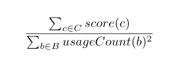

+++
slug = "/blog/vocabulary-optimization"
date = "2025-02-16"
title = "Onion = Cry Vegetable: Generating compound words for artificial languages"
+++

One of the things that struck me about learning Japanese is that once you know a decent number of kanji, there are a lot of words you can read and understand without ever having seen before. This is because kanji often convey specific meanings: the word for building (`建物`) is `build`+`thing`, confidence (`自信`) is `self`+`believe`, etc. In some cases you can even guess the kanji of a word you hear for the first time, and get to its meaning that way. 

There are cases in English where you can guess a word you've never seen before, but most of them are just instances of productive[^vo_4] affixes like `-ness` as in `kindness` or `re-` in `rewrite`, or words with a recognizable latin root. Arguably, the closest thing English has to words that are guessable from their kanji is compound words. Not all of these are easy to guess from their constituents, but some are: we have `mailbox`, `firefighter`, `waterfall` and more. This matters because easily guessable compound words reduce the effort required for memorizing new vocabulary. For example, [Esperanto](https://en.wikipedia.org/wiki/Esperanto) - the most widely used constructed language - makes extensive use of compounding as well as productive affixes (although we are only talking about compounding today).

The question now is whether there is a decent way to automate the process of generating compounds. This involves both considerations about individual compounds - the combined words have to be semantically related to the idea expressed by the compound in order to be guessable - and the whole vocabulary, since the more compounds a word is used in, the less useful it becomes as a hint. So, we need a method that can consider multiple critera while searching for an optimal vocabulary of compounds.

## As a search problem
Our starting point is a set of meanings that we want to represent with words (compound or not), which we will call ideas and represent with English words. Given this base set of ideas *I*, we can think of the process of constructing a vocabulary as the process of selecting a set of base words *B* from *I* (*B ⊂ I*), and expressing the remaining elements of *I* as compounds of two words from *B*[^vo_1].This results in a set of compounds *C*, where each element is a tuple representing an expressed idea and two base words: *C = { (i, b1, b2) ∣ b1 ∈ B, b2 ∈ B, i ∈ I }*.

For example, say that *I* was the three words below:

> sky

> water

> rain

I would say that the optimal outcome here is to take `sky` and `water` as base words, and express `rain` as `skywater`. So we have the two aforementioned base words, which combine to form a compound `skywater`.

> *B* = {sky, water}

> *C* = {(rain, sky, water)}

Unfortunately, for most actual languages *I* is going to be thousands or tens of thousands of elements[^vo_2], making it infeasible to do this manually. However, building *B* and *C* from *I* can be thought of as a lengthy sequence of choices, where at each step we choose to either copy an element of *I* to *B*, or to express it as a compound of elements from *B* and add that combination to *C*. This means that while the decision space is very large, we can search it automatically. We just need some criteria to score possible results.

For example, a scoring function *S(I, B, C)* could try to:
1. Maximize the quality of each compound in *C*
2. Minimize the number of base words used in a large number of compounds
3. Maximize the number of compounds to the extent possible without violating #2[^vo_3]

## My attempt (Monte Carlo Tree Search)
The [Monte Carlo Tree Search](https://en.wikipedia.org/wiki/Monte_Carlo_tree_search) (MCTS) algorithm is best known for its use in game-playing AI, but it is usable for anything that can be modeled as a sequence of decisions, as long as you have a way to score outcomes. It seemed like a natural choice for this problem, although I'm not an expert in optimization methods. [This page](https://mcts.ai/about/index.html) provides a good overview of MCTS, so I will cover only the basic ideas here. I will borrow the graphic they used though, because it communicates the core ideas pretty well. 

MCTS essentially consists of four steps repeated iteratively.
1. **Selection:** starting from the root, travel down the tree looking at node scores to find a promising leaf node.
2. **Expansion:** generate a single child for that leaf node. 
3. **Simulation:** repeatedly generate children to build out a transient subtree of the aforementioned child node, up to completion or a maximum depth, and score it.
4. **Backpropagation:** update the scores of each node along the path to the child node generated in step #2 based on the result of the simulation.

The idea is that if you have a good scoring function and do a decent job tuning hyperparameters to balance exploration and exploitation, MCTS will find a path down the tree that leads to a high-scoring state. In our case, that means a good compound vocabulary, built by the choices made at each node in the path. To make implementation simpler, I only tried to optimize compound selection and creation, fixing the target number of generated compounds as a percentage of the size of *I*. That is, I only tried to optimize #1 and #2 of the criteria from the end of the previous section. Consequently, each node in the MCTS tree corresponded to selecting one yet unused idea from *I*, choosing two base words from *B* to combine, and adding the resulting compound to *C*. 

### Generating and Evaluating Compounds
In order to make sure that the words combined to generate compounds were semantically related to the idea that they represented, I used [ConceptNet](https://conceptnet.io/) to gather candidates for words to combine. ConceptNet is a knowledge graph connecting English word nodes with edges representing semantic relationships; traversing the edges connected to the idea for a compound to find base words to combine ensures there is some kind of semantic relationship between the idea expressed by the compound and the words that compose it. That is, we want something self-explanatory like `firefighter` and not something like `honeymoon`.

Concretely, for each generation, an idea is chosen randomly from ideas in *I*, and words to be combined into a compound are chosen randomly from the subset of candidates gathered from ConceptNet that were also in *I*. Any words chosen this way are added to *B*. I experimented with using scoring to choose better child nodes during expansion and simulation, but this dramatically slowed down processing. Also, theoretically scoring can be done only at the end of simulation and then backpropagation will take care of individual node scores, so I scored only at the end of simulation.

Developing a good scoring function for evaluating word combinations as compound words is a difficult task on its own, so I opted for the simplest thing I could think of: word vector cosine similarity of the words used in the compound to the word representing the idea. That is, the score was the average of cosine similarity for the two base words and a relation score based on manually assigned values for types of relations in ConceptNet (I.E. x `is a` y should score higher than x `desires` y, etc.). So we end up with, *score(compound) = (similarity(b1, i) + similarity(b2, i) + relationScore) / 3*. 

### MCTS Scoring function
The scoring function used for MCTS needs to be able to score states resulting from a given path down the tree, as opposed to specific nodes or compounds. In this case, a state is just a set of generated compounds *C*, along with counts for each base word in *B*, where we define base words as any words used in compounds. I tried to optimize the aforementioned criteria #1 (compound quality) and #2 (minimal base words with too many uses) by computing the score as the sum of the score for each compound divided by the sum of squares for base word usage counts. 

## Results
As is likely obvious from my explanation up until now, I took some shortcuts with implementation in order to get to a working proof of concept. Consequently, between a fairly flimsy scoring function and not having enough compute on my laptop to run large numbers of MCTS iterations, I did not end up with something I would call a good solution to the problem. However, the process did yield a few outputs that I think are worth sharing. The code is available [here](https://github.com/Mindful/wordgen) for anyone interested in trying to do this better.

### Cherrypicked Outputs
These are all actual outputs of the process, although the combinations are technically unordered.

- segment+year = month
- crime+theft = robbery
- beach+edge = shore
- act+wedding = marriage
- cry+vegetable = onion
- computer+storage = disk
- air+crime = pollution
- bottom+dress = skirt

Some of the combinations are kind of abstract, like `act+wedding` for `marriage`, but I quite like `cry+vegetable` for `onion`. In all cases though we can see that the compounds make some kind of sense for the ideas they represent; onions are vegetables that make you cry, a month is a segment of a year, etc. That said, most of the outputs are not this good - below are a few examples I don't think turned out very well.

- class+senior = freshman
- kitchen+meal = cook 
- chicken+male = hen 

Like many of the other outputs, these three are made up of words that show up in similar contexts to the idea word but are not a good fit to express the intended idea, which is a symptom of using a scoring method based on word vectors (distributional semantics). Full results can be seen [here](https://github.com/Mindful/wordgen/blob/main/results/generations_simple.txt).

## Final Thoughts
A robust implementation of MCTS for generating compound words, including good scoring function(s), could probably be its own paper. I think to get something working well, you would at least need:
- A good compound scoring function
- An MCTS implementation that could also explore the number of ideas expressed as compounds
- A lot of compute

You might also want:
- Intermediate scoring to be smarter about generating child nodes in MCTS (I.E. smarter than completely random)
- More tools than just ConceptNet for finding words with semantic relations to the idea being expressed

I am not going to take this project all the way to a paper, but I do think it's an interesting project that has the potential to be useful for artificial language construction. If you happen to want to pick up the torch and flesh this out though, please don't hesitate to reach out.

[^vo_4]: [Productivity](https://en.wikipedia.org/wiki/Productivity_(linguistics)) is a linguistics term. 
[^vo_1]: Obviously compounds of more than two words exist, but two-word compounds are much more common, and limiting ourselves to compounds of only two words helps keeps the problem framing manageable.
[^vo_2]: The exception being Toki Pona, with only a little more than a hundred words.
[^vo_3]: There is a natural tension between minimizing base words used in many compounds and maximizing the number of compounds, because *I* is finite - the more ideas from *I* we express as compounds, the fewer base words we have to choose from for making any given compound.