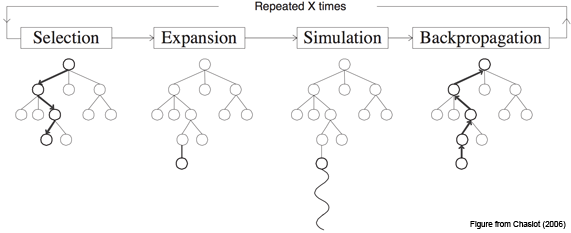

+++
slug = "/blog/vocabulary-optimization"
date = "2025-01-23"
title = "最適な複合語語彙を見つける手法"
+++

日本語を学んでいく中で特に印象的だったのは、覚えた漢字が一定数を超えると、それまで見たことのない単語でも読めたり意味を推測できたりすることです。これは漢字そのものが意味を持つから可能です。たとえば、建物は建つ物、自信は自分を信じること、などのように漢字から意味がわかる単語が少なからずあります。初めて耳にする言葉でも、その漢字を推測して意味に辿り着けることもあります。

英語でも見たことのない単語の意味を推測できる場合はありますが、主に`-ness`（例：kindness）や`re-`（例：rewrite）といった生産的な接辞か、認識しやすいラテン語由来の語根を持つ単語です。英語において、漢字から推測可能な単語に最も近いのは複合語だと思っています。すべてが推測可能というわけではありませんが、`mailbox`（郵便箱）、`firefighter`（消防士）、`waterfall`（滝）など、わかりやすいものもあります。この話がなぜ大事なのかというと、こういった推測しやすい複合語が多いほど新しい語彙を覚える負担が減ります。たとえば、[エスペラント](https://ja.wikipedia.org/wiki/%E3%82%A8%E3%82%B9%E3%83%9A%E3%83%A9%E3%83%B3%E3%83%88)（最も広く使われている人工言語）は、生産的な接辞と複合語を広範に活用しています（今回話すのは複合語のみですが）。

さて、本題は複合語を自動生成する方法があるかどうかですね。複合語を構成する単語がその複合語の意味と関連している必要があります。同時に、語彙全体も考える必要があります。1つの単語が多くの複合語に使われすぎると、手がかりとしての役割が薄れます。そのため、複数の基準を考慮しながら、最適な複合語語彙を見つける方法が必要になります。

## 探索問題としての捉え方

まず初めに、表現したい意味の集合を考えます。これを「アイデア」と呼び、英単語で表現します。このアイデアの集合 を*I*とし、 語彙を構築するプロセスは、*I* から基礎語の集合 *B* を選び（*B ⊂ I*）、*I* の残りの要素を *B* の2つの単語を組み合わせた複合語として表現することと考えられます[^vo_1]。これにより、複合語の集合 *C* が生まれます。*C* の各要素は、アイデアと2つの基礎語を表すタプルになります：*C = { (i, b1, b2) ∣ b1 ∈ B, b2 ∈ B, i ∈ I }*。

たとえば、以下のような3つの単語が *I* に含まれているとします：

> sky

> water

> rain

この場合、最適な結果は `sky` と `water` を基礎語に選び、`rain` を `skywater` という複合語で表現することだと言えるでしょう。つまり、基礎語の集合は以下のようになります：

> *B* = {sky, water}

そして、それらが組み合わさって以下の複合語の集合が得られます：

> *C* = {(rain, sky, water)}

しかし、実際の言語では *I* が何千、何万といった規模になるため[^vo_2]、これを手作業で行うのは現実的ではありません。ただし、*I* から*B* と *C* を生み出処理を、*I*の要素を*B*にコピーするか*I*の要素を表す複合語を作り出すかを次々と選択する長い決定の連続とみなすことができます。決定空間は広大でも自動探索することは可能です。しかし、結果を評価する基準が必要になってきます。

たとえば、以下のような評価基準となる関数 *S(I, B, C)* を考えられます：
1. *C* に含まれる各複合語の質を最大化する
2. 多数の複合語に使用される基礎語の数を最小化する
3. #2を損なわない範囲で可能な限り多くの複合語を作る[^vo_3]

## 私の試み（モンテカルロ木探索）

[モンテカルロ木探索](https://ja.wikipedia.org/wiki/%E3%83%A2%E3%83%B3%E3%83%86%E3%82%AB%E3%83%AB%E3%83%AD%E6%9C%A8%E6%8E%A2%E7%B4%A2)（MCTS）のアルゴリズムはゲームAIのものと認識されることが多いと思いますが、評価基準さえあれば決定の連続としてモデル化できるも問題のどれにも適用できます。本プロジェクトにも適切に思いましたが、最適化手法に特別詳しいわけではありません。[こちらのページ](https://mcts.ai/about/index.html)にMCTSの概要が掲載されていますので、ここでは基本的な考え方だけ説明します。ただし図があると非常にわかりやすくなってくるので、それだけは借りさせていただきます。

MCTSは、以下の4つのステップを繰り返して行われます：
1. **選択:** ルートから始めて、スコアを考慮しながら有望な葉ノードを探します。
2. **展開:** その葉ノードに1つの子ノードを生成して追加します。
3. **シミュレーション:** 完成または深さの最大値に至るまでノードの生成を繰り返し、上記の子ノードの仮サブツリーを構築してスコアします。
4. **逆伝播:** スコアを根ノードまで伝播します。

理論上、良い評価関数があり、かつハイパーパラメータをうまく調整して探索と活用のバランスを取れれば、MCTSは高得点の状態（結果）に至るパスを見つけてくれます。本プロジェクトでその高得点の状態というのは、パスにある各ノードで行われた選択に構造された複合語の語彙です。

実装の複雑さを抑えるため、今回は複合語の選択と作成の最適化だけを目指し、生成される複合語の目標数を *I*のサイズの一定割合に固定しました。つまり、前節の基準で挙げた#1（複合語の質）と#2（基本語の最小化）のみを最適化対象としました。なのでMCTSツリーの各ノードは、未使用のアイデアを1つ選択し、2つの基本語を選択して組み合わせ、それによって得られる複合語を*C*に追加する操作を表すことになりました。

### 複合語の生成と評価 (working)

複合語を生成する際に、使用する単語がそのアイデアと意味的に関連していることを保証するため、[ConceptNet](https://conceptnet.io/) を活用して候補単語を収集しました。ConceptNetは英単語をノードとし、それらを意味的な関係で結ぶエッジを持つ知識グラフです。複合語のアイデアに接続されたエッジをたどって基本語を探すことで、複合語が表すアイデアと構成単語の間に少なくとも直感的な関係を持たせることができます。たとえば、`firefighter` のようなわかりやすい言葉を目指し、`honeymoon` のような直感的ではない言葉を避けます。

具体的には、各生成プロセスでアイデアがランダムに *I* から選ばれ、ConceptNetで収集された候補の中から *I* に含まれる単語がランダムに選ばれて複合語が生成されます（このとき、新たに選ばれた単語は *B* に追加されます）。ノードの展開とシミュレーションの際にスコアを活用して子ノードを選ぶ方法も試しましたが、処理速度が大幅に低下しました。また、MCTSの利点の一つは、理論的にスコアリングをシミュレーションの終了時にのみ行い、バックプロパゲーションが各ノードのスコアを調整してくれる点です。

複合語の評価に使用するスコアリング／再ランク付け関数の開発はそれ自体が困難な課題ですが、今回は最もシンプルな方法として、アイデアを表す単語と構成する基本語の単語ベクトル間のコサイン類似度を利用しました。スコアは次の式で計算されます：  
`score(compound) = (similarity(b1, i) + similarity(b2, i) + relationScore) / 3`  
ここで、relationScore は ConceptNet における関係の種類（例：x `is a` y は x `desires` y より高スコア）に基づいて手動で設定しました。

### MCTSのスコアリング関数
MCTSで使用するスコアリング関数は、ツリーを下る特定の経路によって得られる状態を評価する必要があります。この場合、状態とは生成された複合語集合 *C* と、各基本語の使用回数を指します。具体的には、前節で述べた基準#1（複合語の質）と#2（基本語の使用過多を最小化）を最適化するため、複合語のスコアの合計を基本語の使用回数の二乗和で割った値を用いました。

## 結果
説明したように、今回は実装を簡略化してプロトタイプを動かすことを優先しました。そのため、スコアリング関数が単純であったこと、また個人のノートPCでは大量のMCTS反復を実行する計算資源が不足していたことから、問題の良質な解を得るには至りませんでした。ただし、いくつか面白い結果が得られたので共有します。興味のある方は[こちら](https://github.com/Mindful/wordgen)でコードをご覧ください。

### 選りすぐりの出力例
以下は実際に生成された結果の一部です（組み合わせは順不同です）：

- segment + year = month  
- crime + theft = robbery  
- beach + edge = shore  
- act + wedding = marriage  
- cry + vegetable = onion  
- computer + storage = disk  
- air + crime = pollution  
- bottom + dress = skirt  

たとえば、`cry + vegetable` が `onion`（涙を誘う野菜）を表すのは面白いと思います。一方で、以下のようにあまりうまくいかなかった例もあります：  

- class + senior = freshman  
- kitchen + meal = cook  
- chicken + male = hen  

全結果は[こちら](https://github.com/Mindful/wordgen/blob/main/results/generations_simple.txt)にあります。

---

## 最後に
MCTSを用いて複合語を生成する堅牢な実装や優れたスコアリング関数の開発は、それ自体で研究論文になり得ます。本プロジェクトを改善するには以下が必要でしょう：  

- 優れた複合語スコアリング関数  
- 複合語として表現されるアイデアの数を探索可能なMCTS実装  
- 大量の計算資源  

さらに、次のような要素も有用です：  

- MCTSでの子ノード生成を賢くする中間スコアリング（完全にランダムより優れた方法）  
- ConceptNet以外のセマンティック関連を探すツール  

本プロジェクトを論文レベルまで引き上げるつもりはありませんが、人工言語の構築に役立つ可能性がある興味深いアイデアだと思います。この取り組みをさらに発展させたい方がいれば、ぜひ連絡してください！

[^vo_1]: もちろん、2語以上の複合語も存在しますが、2語の複合語が一般的です。また、2語の複合語に限定することで、問題の枠組みを管理しやすくなります。
[^vo_2]: 例外は100語余りしかないトキポナ（Toki Pona）です。
[^vo_3]: 複合語に使われる基本語の数を最小化することと、複合語の数を最大化することには必然的なトレードオフがあります。というのも、*I*（基本的なアイデアの集合）が有限であるため、*I*から複合語として表現するアイデアを増やすほど、複合語を作るために選べる基本語の数が減るからです。