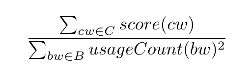

+++
slug = "/blog/vocabulary-optimization"
date = "2025-01-05"
title = "Searching for optimal compound word vocabularies"
+++

One of the things that struck me about learning Japanese is that once you know a decent number of kanji, there are a lot of words you can read and understand without ever having seen them before. This is because kanji generally have meanings associated with them: the word for building (`建物`) is `build`+`thing`, confidence (`自信`) is `self`+`believe`, etc. In some cases you can even guess the kanji of a word you hear for the first time, and get to its meaning that way. 

There are cases in English where you can guess a word you've never seen before, but most of them are just instances of productive affixes like `-ness` as in `kindness` or `re-` in `rewrite` or words with a recognizable latin root. Arguably, the closest thing English has to words that are guessable from their kanji is compound words. Not all of these are easy to guess from their constituents, but some are: we have `mailbox`, `firefighter`, `waterfall` and more.This matters because compound words that can be easily guessed reduce the amount of work a language-learner has to do memorizing new vocabulary. For example, [Esperanto](https://en.wikipedia.org/wiki/Esperanto) (the most widely used constructed language) makes extensive use of compounding and productive affixes. 

The question now is whether there is a half decent way to automate the process of generating compounds for a language. This involves both considerations about individual compounds - the combined words have to be semantically related to the idea expressed by the compound in order to be guessable - and the whole vocabulary, since the more compounds a word is used in the less useful it becomes as a hint. So, we need a way to search for an optimal vocabulary of compounds that considers multiple critera. 

## As a search problem
Our starting point is a set of meanings that we want to represent, which we will call ideas and represent with English words. Given this base set of ideas *I*, we can think of the process of constructing a vocabulary as the process of selecting a set of base words *B* from *I* (*B ⊂ I*), and expressing the remaining elements of *I* as compounds of words from *B*. That means a set of compounds *C*, where each element is a tuple of an expressed idea and two base words like *(i, b1, b2)*.

This is a little bit confusing because we express ideas as English words, but we just have to remember that any given idea (word) could be also be expressed as a compound. For example, say that *I* was the three words below:

> sky

> water

> rain

I would say that the optimal outcome here is to keep `sky` and `water`, and express `rain` as `skywater`. So,

> *B* = {sky, water}

> *C* = {(rain, sky, water)}

Unfortunately, for most actual languages *I* is going to be thousands or tends of thousands of elements[^1], making it infeasible to do this manually. However, given *I*, the process of producing *B* and *C* can be thought of as a lengthy sequence of choices, where at each step we choose to either copy an element of *I* to *B*, or to express it as a compound of elements from *B* and add that combination to *C*. This means that while the decision space is very large, we can search it automatically. We just need some criteria to score possible solutions.

For example, a scoring function *S(I, B, C)* could try to:
1. Maximize the quality of each compound in *C*
2. Minimize the number of base words used in a large number of compounds
3. Maximize the number of compounds to the extent possible without violating #2

## My attempt (Monte Carlo Tree Search)
The [Monte Carlo Tree Search](https://en.wikipedia.org/wiki/Monte_Carlo_tree_search) (MCTS) algorithm is best known for its use in game-playing AI, but it is usable for anything that can be modeled as a sequence of decisions, as long as you have a way to score outcomes. It seemed like a natural choice for this problem, although I'm not an expert in optimization methods. [This page](https://mcts.ai/about/index.html) provides a good overview of MCTS, so I will cover only the basic ideas here. I will borrow the graphic they used though, because it communicates the core ideas pretty well. 

Basically, MCTS consits of four steps which are repeated some number of times. 
1. **Selection:** starting from the root, travel down the tree looking at node scores to find a promising leaf node.
2. **Expansion:** generate a single child for that leaf node. 
3. **Simulation:** repeatedly generate children to build out a transient subtree of the aforementioned child node, up to completion or a maximum depth, and score it.
4. **Backpropagation:** update the scores of each node along the path to the child node generated in step #2 based on the result of the simulation.

The idea is even if this exploration is done largely randomly, as long as the scoring function is good, you will eventually end up with a promising path down the tree.To make implementation simpler, I only tried to optimize compound selection and creation, fixing the target number of generated compounds as a percentage of the size of *I*. That is, I only tried to optimize #1 and #2 of the criteria from the end of the previous section. Consequently, each node in the MCTS tree corresponded to selecting one as of yet unused idea from *I*, choosing two base words to combine, and adding the result to *C*. 

### Generating and Evaluating Compounds
In order to make sure that the words combined to generate compounds were semantically related to the idea that they represented, I used gathered candidates from words related to the idea in [ConceptNet](https://conceptnet.io/). ConceptNet is a knowledge graph connecting English words with edges representing semantic relationships; the graphic from their site does a good job showing what this looks like.

When generating child nodes in the MCTS tree, ideas chosen to be represented as compounds were chosen randomly from yet unused ideas in *I*, and words to be combined to make the compound were chosen randomly from the subset of candidates gathered from ConceptNet that were also in *I*. I experimented with using scoring to choose better child nodes during expansion and simulation, but this dramatically slowed down processing. Also, the main benefit of MCTS is that scoring can be done only at the end of simulation and then backpropagation will take care of individual node scores.

Developing a good scoring/reranking function for evaluating word combinations as compound words could easily be its own research paper, so I opted for the simplest thing I could think of: word vector cosine similarity of the words used in the compound to the word representing the idea. That is, the score was the average of cosine similarity for the two words and a relation score based on manually assigned values for types of relations in ConceptNet. So, *score(compound) = (similarity(word1, idea) + similarity(word2, idea) + relationScore) / 3*. 

### MCTS Scoring function
The scoring function used for MCTS needs to be able to score states resulting from a given path down the tree, as opposed to specific nodes or compounds. In this case, a state is just a set of generated compounds *C*, along with counts for each base word in *B*, where we define base words as any words used in compounds. Concretely, I tried to optimize criteria #1 (compound quality) and #2 (minimal base words with too many uses) from the section at the start of this post, by summing the score for each compound and dividing it by the sum of squares for base word usage counts. 

## Results
As is likely obvious from my explanation up until now, I took some shortcuts with implementation in order to get to a working proof of concept. Consequently, between a fairly flimsy scoring function and not having enough compute on my laptop to run large numbers of MCTS iterations, I did not end up with something I would call a good solution to the problem. The code is available [here](https://github.com/Mindful/wordgen) for anyone interested in trying to do this better.

That said, I did get it working well enough that I can share some cherrypicked results that I found interesting or amusing. These are all actual outputs of the process, although the combinations are technically unordered.

- segment+year = month
- crime+theft = robbery
- beach+edge = shore
- act+wedding = marriage
- cry+vegetable = onion
- computer+storage = disk
- air+crime = pollution

Full results can be seen [here](https://github.com/Mindful/wordgen/blob/main/results/generations_simple.txt) for anyone interested.

[^1]: The exception being Toki Pona, with only a little more than a hundred words.